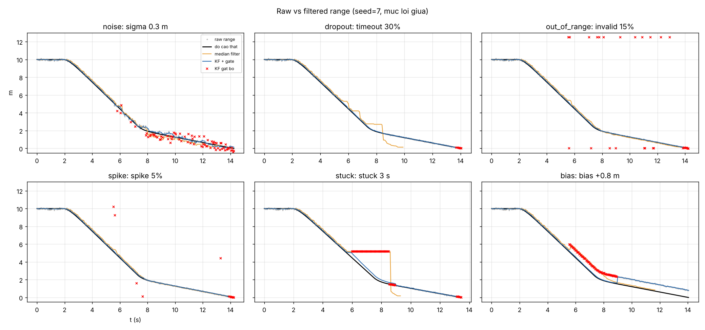
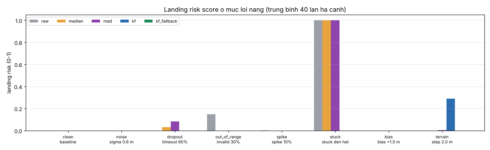
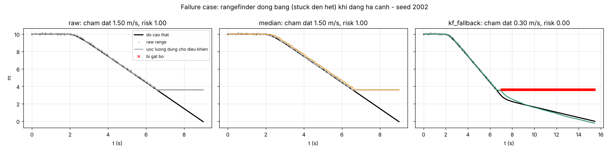
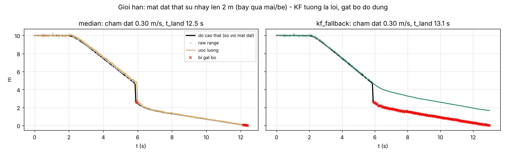

# T6 · Drone rangefinder fault detector

**Nhóm OHappy** · Nguyễn Đức Đông, MSV 2A202602367 · K4 Track 4, Day 04 (Sensor Reality Sprint) 
Repo: `K4-Track4-Day04-OHappy-Sensor-Reality-Sprint` · Lệnh chạy: `python src/rangefinder_benchmark.py` · Log: `out/benchmark_log.txt`

> Quy ước trong báo cáo: **[Nhóm đo]** là kết quả benchmark nhóm tự chạy trên dữ liệu tổng hợp. **[Nguồn]** là điều tài liệu PX4 nêu. **[Giả thuyết]** là suy luận, nhóm chưa đo.

---

## 1. Bài toán

| Mục | Nội dung |
|---|---|
| Nền tảng / tính năng | **Drone**, tự động hạ cánh (precision landing / giữ độ cao thấp) |
| Cảm biến | Rangefinder một tia (ToF/LiDAR kiểu TFmini, LightWare), 20 Hz, dải đo 0.1–12 m. Barometer + IMU là nguồn tham chiếu phụ |
| Lỗi thực tế | Nắng làm nhiễu ToF; mất gói / timeout; giá trị ngoài dải (0 hoặc > max); spike do phản xạ ở mép vật, cỏ, bụi; driver treo nên **lặp lại giá trị cũ (stuck)**; mặt nước hoặc cỏ cao làm đo **xa hơn thực tế (bias)** |
| Claim ban đầu | Khi rangefinder bị stuck hoặc ra giá trị sai, controller tưởng drone còn cao nên vẫn hạ nhanh. Vận tốc chạm đất (landing risk) **tăng**. Một detector có kiểm tra nhất quán với IMU/baro sẽ giữ landing risk gần mức baseline |
| Metric | Timeout rate (%), range variance (m²), precision/recall phát hiện mẫu lỗi, RMSE độ cao khi h < 3 m (m), **landing risk** = clip((v_chạm_đất − 0.4)/0.8, 0, 1), tỉ lệ hard landing (v ≥ 0.9 m/s), thời gian hạ cánh (s) |

## 2. Phương pháp

**[Nguồn] PX4 EKF2** (docs *Using the ECL EKF → Range Finder*, PR #19340):

- EKF2 làm **kinematic consistency check**: so đạo hàm theo thời gian của range với vận tốc đứng ước lượng. Nếu không nhất quán về mặt thống kê, rangefinder bị loại cho tới khi kiểm tra đạt lại liên tục **≥ 1 s ở tốc độ đứng ≥ 0.5 m/s**.
- Độ nhạy chỉnh bằng `EKF2_RNG_K_GATE`.
- Ở chế độ *conditional range aiding*, khi không đủ điều kiện dùng range thì hệ thống tự chuyển sang nguồn độ cao phụ (baro).
- Mục đích của cơ chế này là xử lý mây, nước, vật cản và cảm biến hỏng, những trường hợp mà chỉ số chất lượng do cảm biến tự báo không đáng tin.

**Các phương án nhóm cài đặt và so sánh** (cùng dữ liệu, cùng seed):

| Mode | Input → Output | Cách phát hiện lỗi |
|---|---|---|
| `raw` | range → độ cao | Không phát hiện; timeout thì giữ giá trị cũ |
| `median` | range → median 5 mẫu | Validity (min/max, timeout) + lệch median > 0.5 m |
| `mad` | range → Hampel | Validity + MAD z-score > 3 (cửa sổ 15) |
| `kf` | range + IMU v_z + baro → độ cao | Validity + **innovation gate 3σ** + **stuck check** (range không đổi 0.5 s trong khi IMU báo đang chuyển động) + **lệch baro > 1 m kéo dài ~1 s** |
| `kf_fallback` | như `kf` + mức sức khỏe | Thêm luật **S1/S2/S3** điều chỉnh tốc độ hạ (mục 5) |

**Vì sao dùng mô phỏng thay cho chạy PX4 gốc:** để chạy PX4 SITL/Gazebo cần cài toolchain và môi trường giả lập, việc này mất quá thời gian của buổi lab 120 phút. Bay drone thật thì không có thiết bị và không an toàn trong lớp. Vì vậy nhóm tự cài lại **ý tưởng** của các bước kiểm tra trong EKF2 (innovation gate, kinematic consistency, fallback sang baro) trong một script Python nhỏ. Proxy metric là vận tốc chạm đất và landing risk của một controller hạ cánh đơn giản. Proxy này đủ để kiểm tra claim "lỗi rangefinder thì hạ cánh nguy hiểm hơn". Nó **không chứng minh** được hành vi thực tế của PX4 hay độ an toàn của một drone cụ thể.

Giả định: IMU và baro không lỗi (baro có bias ±0.4 m, nhiễu 0.25 m), địa hình phẳng, drone chỉ chuyển động thẳng đứng.

## 3. Benchmark

**Dữ liệu (tổng hợp):**

- Hạ cánh từ 10 m, 20 Hz, nhiễu nền σ = 2 cm + 0.5 %·h.
- Lỗi bắt đầu ngẫu nhiên tại t = 3–7 s, mỗi loại 3 mức đặt tên theo tham số.
- 40 seed cho mỗi cấu hình, tổng cộng 4 200 lần hạ cánh.
- Có thêm kịch bản `terrain`: mặt đất **thật sự** nhô lên. Đây không phải lỗi, dùng để đo báo động nhầm.

**Định nghĩa metric (cố định từ trước khi chạy, dùng chung cho mọi điều kiện):**

| Metric | Đơn vị | Tốt khi | Phản ánh |
|---|---|---|---|
| Timeout rate, range variance (r − h_thật) | %, m² | thấp | Sức khỏe cảm biến |
| Precision / recall phát hiện mẫu lỗi; false alarm trên mẫu sạch | 0–1 | P, R cao; FA thấp | Chất lượng detector |
| RMSE độ cao khi h < 3 m | m | thấp | Chất lượng bộ lọc |
| Landing risk, hard landing %, thời gian hạ cánh | 0–1, %, s | thấp | Tác động lên tính năng hạ cánh |

**Các điều kiện so sánh** (cùng pipeline, mỗi lần chỉ đổi một yếu tố):

| Điều kiện | Tham số thay đổi | Bằng chứng |
|---|---|---|
| Baseline | Không cố ý tạo lỗi | `out/benchmark_log.txt`, dòng `clean baseline` |
| Lỗi A: stuck | 1 s / 3 s / đến hết | dòng `stuck`, `out/failure_case_stuck.png` |
| Lỗi B: noise, timeout, invalid, spike, bias | 3 mức mỗi loại, đặt tên theo tham số | các dòng tương ứng, `out/raw_vs_filtered.png`, `out/recall_vs_level.png` |
| Không phải lỗi: terrain | Bậc địa hình 0.5 / 1 / 2 m | dòng `terrain`, `out/limitation_terrain.png` |

**Kết quả chính ở mức lỗi nặng [Nhóm đo]** (trích từ `out/benchmark_log.txt`, trung bình 40 lần):

| Điều kiện | Metric | raw | median | mad | kf | kf_fallback |
|---|---|---|---|---|---|---|
| Baseline | RMSE h<3 m (m) / hard % | 0.03 / 0 | 0.06 / 0 | 0.03 / 0 | 0.02 / 0 | 0.02 / 0 |
| Spike 10 % | recall / RMSE (m) | 0 / 0.84 | 0.89 / 0.09 | 0.95 / 0.08 | 0.96 / 0.02 | 0.97 / 0.02 |
| Invalid 30 % | recall / RMSE (m) | 0 / 4.36 | 1.00 / 0.12 | 1.00 / 0.04 | 1.00 / 0.02 | 1.00 / 0.02 |
| Timeout 60 % (đo được 34–45 %) | RMSE (m) / hard % | 0.21 / 0 | 0.47 / 2 | 0.45 / 10 | 0.03 / 0 | 0.03 / 0 |
| Noise σ 0.6 m | recall / RMSE (m) | 0 / 0.60 | 0.36 / 0.35 | 0.12 / 0.55 | 0.65 / 0.27 | 0.64 / 0.27 |
| **Stuck 3 s** | recall / **hard %** | 0 / **22** | 0 / **25** | 0 / **28** | 0.85 / 0 | 0.85 / 0 |
| **Stuck đến hết** | recall / **v chạm đất (m/s)** | 0 / **1.50** | 0 / **1.50** | 0 / **1.50** | 0.94 / 0.30 | 0.97 / 0.30 |
| Bias +0.3 / +0.8 / +1.5 m | recall (kf) | – | – | – | 0.00 / 0.49 / 1.00 | 0.00 / 0.39 / 1.00 |
| Terrain step 2 m (không phải lỗi) | false alarm / hard % | 0 / 0 | 0.01 / 0 | 0.04 / 0 | **0.33 / 15** | 0.67 / **0** |

**Tổng hợp trên baseline và mọi lỗi (không tính terrain) [Nhóm đo]:**

| | raw | median | mad | kf | kf_fallback |
|---|---|---|---|---|---|
| Landing risk TB | 0.076 | 0.067 | 0.072 | 0.000 | 0.000 |
| Hard landing | 6.4 % | 6.7 % | 7.2 % | 0 % | 0 % |
| Thời gian hạ cánh TB | 13.1 s | 12.9 s | 13.2 s | 14.0 s | 17.2 s |

## 4. Failure case: rangefinder bị đóng băng (stuck) khi đang hạ cánh

- **Lỗi và mức:** `stuck đến hết`, seed 2002. Range đứng yên ở ~3.6 m từ t ≈ 6.6 s, trong khi drone vẫn đang xuống.
- **Metric thay đổi [Nhóm đo]:**
  - Với raw/median/MAD: RMSE độ cao khi h < 3 m tăng từ 0.03 m (baseline) lên **4.43 m**, vận tốc chạm đất từ 0.30 lên **1.50 m/s**, landing risk từ 0 lên **1.00**, hard landing **100 %** (40/40 lần).
  - Ngay cả khi chỉ stuck 3 s, tỉ lệ hard landing đã là 22–28 %.
- **Ảnh hưởng tới tính năng:** controller thấy "còn 3.6 m" nên không bao giờ chuyển sang chế độ hạ chậm, và drone đâm xuống đất ở tốc độ hành trình.
- **Vì sao median/MAD không cứu được:** giá trị stuck *rất ổn định*, nên median bằng chính nó và MAD ≈ 0. Bộ lọc thống kê chỉ nhìn vào bản thân tín hiệu nên coi đây là dữ liệu tốt. Cần một nguồn độc lập (vận tốc IMU) để thấy mâu thuẫn "range không đổi nhưng drone đang di chuyển". Đây cũng chính là ý tưởng kinematic consistency của PX4 [Nguồn].
- **Nhóm quan sát:** trên dữ liệu tổng hợp, kiểm tra "range đứng yên trong khi IMU báo đang di chuyển" bắt được 94–97 % mẫu stuck và đưa hard landing từ 100 % về 0 %.
- **Tài liệu PX4 cho biết:** EKF2 so đạo hàm của range với vận tốc đứng để loại rangefinder khi bị che khuất hoặc hỏng, và chỉ dùng lại sau khi kiểm tra đạt ≥ 1 s. PX4 không công bố con số nào để so trực tiếp với benchmark này, nên nhóm **không** ghép hai nguồn thành một phép so sánh.
- **Lỗi chưa bắt được [Nhóm đo]:** bias +0.3 m có recall 0 với mọi phương án, vì nhỏ hơn bias và nhiễu của baro (±0.4 m, σ 0.25 m). Bias +0.8 m chỉ bắt được 49 %.

## 5. Quyết định kỹ thuật

**Luật fallback nhóm định nghĩa** (xét trong cửa sổ 1 s = 20 mẫu):

| Mức | Điều kiện | Hành động |
|---|---|---|
| S1 healthy | < 10 % mẫu bị gạt | Dùng range trong Kalman, hạ cánh bình thường |
| S2 degraded | ≥ 10 % mẫu bị gạt | Chỉ dùng mẫu qua gate; hạ tối đa **0.5 m/s** |
| S3 failed | ≥ 40 % mẫu bị gạt, **hoặc** stuck, **hoặc** mất/invalid liên tục ≥ 0.5 s | Bỏ rangefinder, dùng baro + IMU; hạ **0.3 m/s** (thực tế nên thêm hover / RTL nếu S3 kéo dài) |

**Giới hạn, cũng là trade-off quan trọng nhất:**

- **[Nhóm đo]** Khi mặt đất *thật sự* nhô lên 2 m (bay qua mái nhà hoặc bệ đỗ), `kf` coi bước nhảy này là lỗi: 33 % mẫu sạch bị gạt và **15 % số lần hạ cánh là hard landing**. Ngược lại, median gần như không báo nhầm (1 %).
- Khi bật `kf_fallback`, lỗi đó chuyển sang S3 và drone hạ chậm, nên hard landing về **0 %**. Cái giá là thời gian hạ cánh dài hơn (16.1 s so với 12.2 s của raw), và ước lượng độ cao lệch ~1.7 m khi chạm đất.
- Tính trung bình trên mọi lỗi, fallback làm hạ cánh lâu hơn **~23 %** (17.2 s so với 14.0 s).

**Khi nào dùng phương án nào:**

- **Drone hạ cánh tự động:** nên dùng `kf_fallback`. An toàn là ưu tiên, chấp nhận hạ chậm hơn.
- **Terrain following** ở địa hình nhiều bậc: cần nới gate hoặc thêm logic "chấp nhận bậc địa hình nếu range ổn định sau bước nhảy", vì PX4 cũng yêu cầu đạt lại kiểm tra trong ≥ 1 s [Nguồn].
- **Median/MAD:** rẻ, tốt cho spike và giá trị invalid, nhưng **không đủ** để bảo vệ hạ cánh vì không bắt được stuck/bias.
- **Robot mặt đất chạy chậm:** chỉ cần median + timeout.

**Bước tiếp theo:**

1. Ghi log thật từ TFmini/VL53L1X: bay trên nước, cỏ, ngoài nắng, để kiểm tra lại recall với bias và noise. **Kiểm chứng bằng:** recall và range variance trên log thật so với bảng ở mục 3.
2. Thêm kiểm tra "terrain step hợp lệ" (chấp nhận bước nhảy nếu range ổn định ≥ 1 s sau bước nhảy) rồi đo lại. **Kiểm chứng bằng:** false alarm của kịch bản terrain 2 m dưới 5 %, trong khi hard landing của stuck và terrain vẫn là 0 %.
3. So sánh với radar altimeter khi bay trên mặt nước. [Nguồn] PX4 docs ghi radar hoạt động được trên mọi địa hình, kể cả mặt nước. **[Giả thuyết]** Radar sẽ giảm lỗi bias trên mặt nước.

**Giới hạn của benchmark:** dữ liệu tổng hợp; mô hình lỗi do nhóm tự đặt; IMU và baro được giả định không lỗi; chưa đo trên phần cứng; controller đơn giản hơn PX4 rất nhiều. Vì vậy các con số chỉ dùng để so sánh tương đối giữa các phương án, không đại diện cho drone thật.

---

**Nguồn đã đọc:**

- PX4 docs, Using the ECL EKF, phần Range Finder (bản `main`, truy cập 05/10/2026): https://docs.px4.io/main/en/advanced_config/tuning_the_ecl_ekf.html
- PX4 docs, Distance Sensors (Rangefinders): https://docs.px4.io/main/en/sensor/rangefinders.html
- PX4-Autopilot PR #19340, "Range finder kinematic consistency check": https://github.com/PX4/PX4-Autopilot/pull/19340

**Phân công:** nhóm có 1 thành viên. Nguyễn Đức Đông đảm nhận cả 4 vai trò (research, chạy code, ghi benchmark, thuyết trình), xem `TEAMMATES.md`.

**Tái lập:** `pip install -r requirements.txt && python src/rangefinder_benchmark.py` (Python 3.13, numpy 2.5.3, pandas 3.0.5, matplotlib 3.11.2; seed cố định, chạy lại cho kết quả giống hệt).
